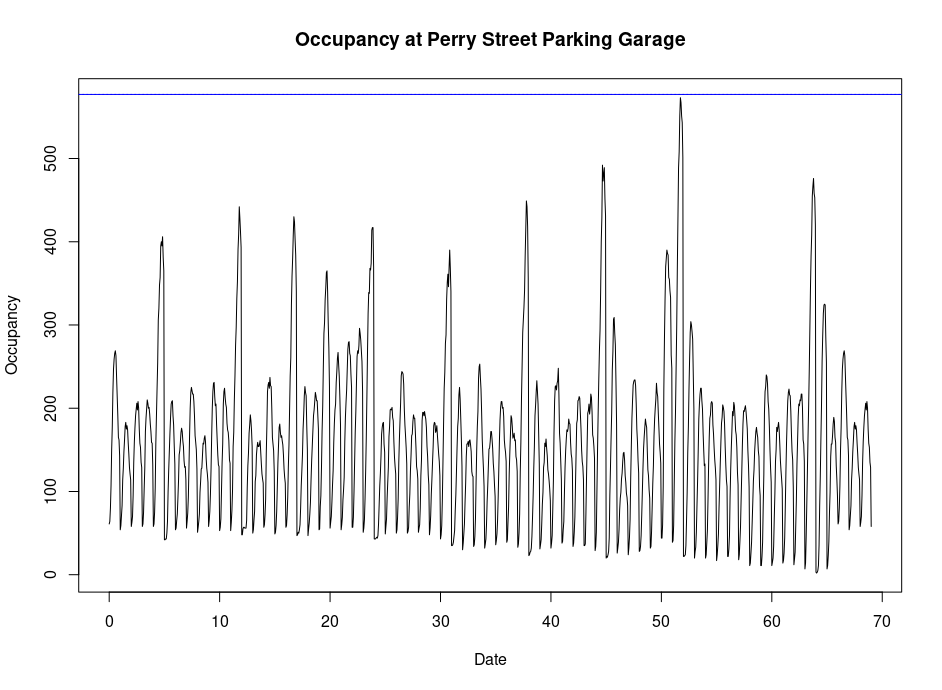

YouTube 
https://youtu.be/qF-jjjOtW6k

Deployment https://parking-service-wbqwfbkqha-ue.a.run.app

## Project Setup

Our project is a parking app that addresses the challenge of finding available parking spots in crowded areas. Our goal is to make it easier for drivers to find parking quickly and avoid wasting time searching for spots.

We chose to develop a solution inline with the following UN sustainable development goals: (1) Industry, Innovation and Infrastructure, (2) Sustainable cities and communities, (3) Responsible consumption and (4) Climate Action

## Implementation

Our team chose a microservices architecture for our solution. The backend was implemented using Firebase, which provided us with a serverless architecture that enabled rapid development and scalability. The frontend was implemented using React, which allowed us to build a responsive and interactive user interface. We also used R and time series machine learning analysis to develop a forecasting model that predicts the number of available parking spots in a given area.

## Demonstration

Our application has a simple, easy to use interface. Users are immediately presented with a Google Maps interface that allows them to view parking lot locations in their local area. Information regarding each parking lot is displayed, namely the available spots in the parking lot. Additional information such as parking cost is also displayed. At the moment we are able to analyze historical parking data and generate forecasts about the occupancy at the lot going into the future.

## Scalability / Next Steps

Our next steps involve integrating an interactive version of this forecasting information to the frontend, experimenting with more powerful machine learning time series models and expanding to mobile platforms.

## Goals

It is with this application we hope to better inform people and help them making wiser decisions about their methods of transportation, thereby reducing congestion in cities and reducing traffic emissions for a healthier, happier tomorrow.
